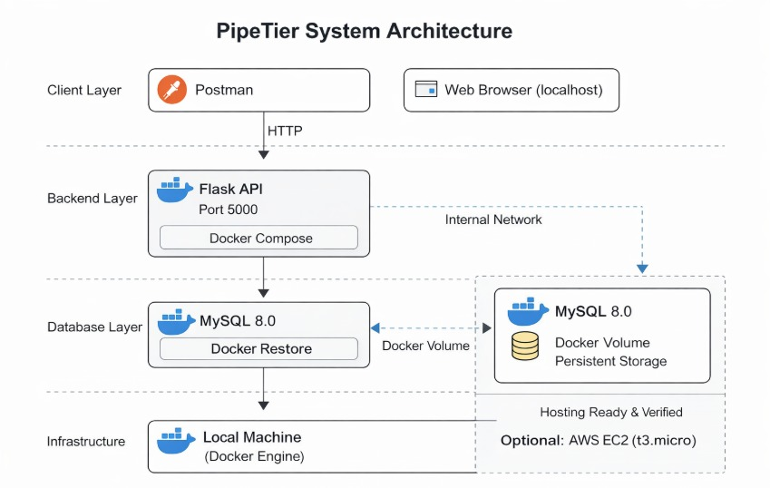
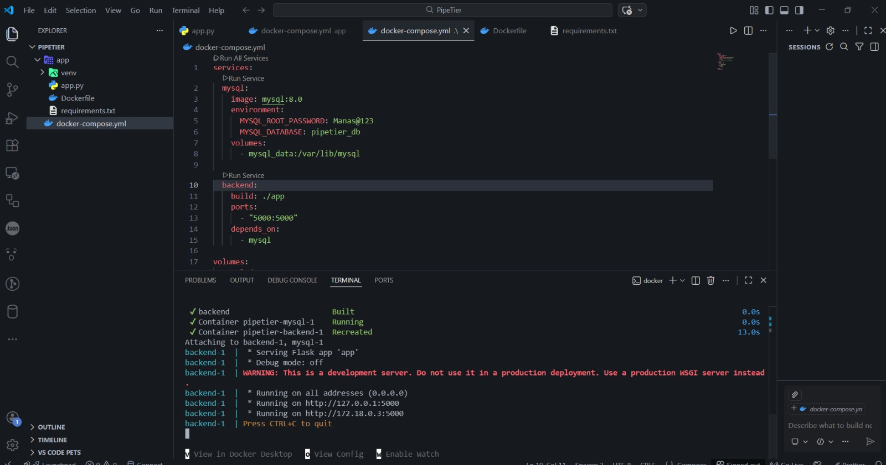
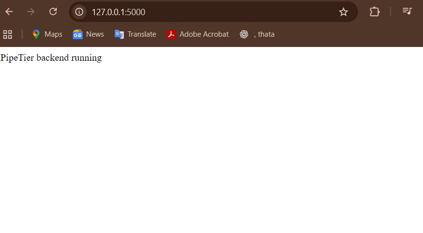
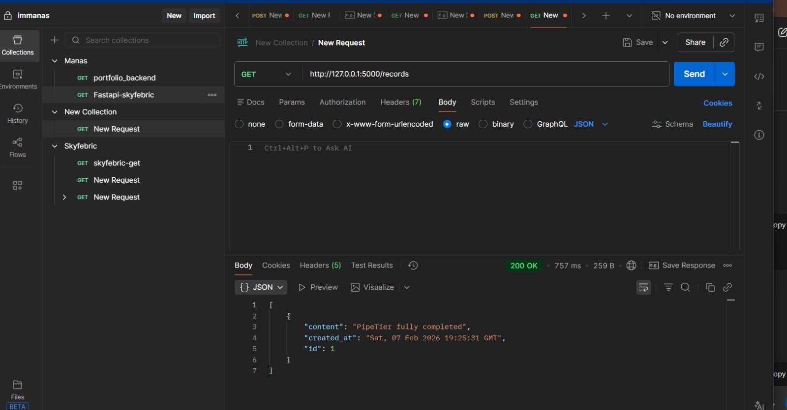
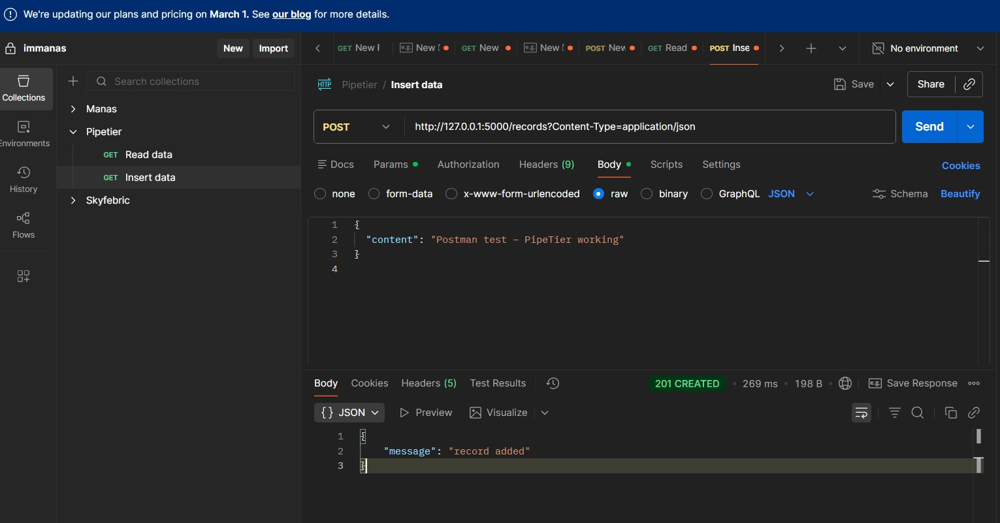

# 🚀 PipeTier — Containerized Backend with Persistent Storage

PipeTier is a **Dockerized Flask backend** connected to **MySQL**, built to demonstrate **real backend execution, container orchestration, and data persistence**, with verified testing and cloud hosting proof.

This project focuses on **working systems**, not slides or mock demos.

## 🧠 One-Line Truth
A real backend API that runs in Docker, stores data in MySQL, and is verified locally and on AWS EC2.

## ❓ Why This Project Exists

In many beginner projects:
- APIs run only on localhost
- Docker is used without persistence
- Cloud experience is claimed without proof

**PipeTier exists to close that gap.**

It answers:
> *Can this backend actually run, store data, and be verified end-to-end?*

---

## 📌 What PipeTier IS / IS NOT

### ✅ PipeTier IS
- A Flask REST API 🐍
- Dockerized using Docker & Docker Compose 🐳
- Connected to MySQL with persistent storage 🗄️
- Tested using Postman 🔍
- Verified on AWS EC2 ☁️

### ❌ PipeTier is NOT
- A frontend app
- A SaaS product
- A managed cloud service
- A fake demo or screenshot-only project

---

## 🧩 Real Problems PipeTier Solves

| Real-World Problem | What Usually Happens | How PipeTier Solves It |
|--------------------|----------------------|-------------------------|
| Backend runs only on localhost | Apps work only on developer machines | Runs inside Docker containers, making it portable and reproducible |
| Database data gets lost on restart | Containers are recreated without persistent storage | Uses Docker volumes to ensure MySQL data persists |
| Hard-to-setup multi-service apps | Manual setup of backend and database leads to errors | Docker Compose brings up the full stack with one command |
| Incorrect container networking | Developers use `localhost` instead of service names | Uses service-name based networking (`mysql`) like real deployments |
| No proof of actual execution | Projects show only code or screenshots without verification | Includes real test results and EC2 deployment proof |
| Lack of cloud deployment experience | Many projects never leave the local machine | Deployed and tested on AWS EC2 with public access |
| Unverified APIs | Endpoints are not tested end-to-end | Tested with real POST and GET requests using Postman |
| No persistent system behavior | Data disappears between runs | Demonstrates stateful backend with persistent storage |

----

## 🏗️ System Architecture

---

## Why This Design?

- This project uses a simple and practical two-tier architecture to demonstrate real-world containerized deployment patterns.
- Docker Compose simplifies the setup of multiple services with a single command.
- Service-name based networking (mysql) reflects actual Docker container communication instead of using localhost.
- Persistent volumes ensure database data is not lost when containers restart.
- Flask provides a lightweight, readable backend suitable for learning and rapid development.

---

## ⚙️ Tech Stack

- 🐍 Python (Flask) — Backend web application
- 🐳 Docker — Containerization
- 🧩 Docker Compose — Multi-container orchestration
- 🗄️ MySQL 8.0 — Relational database
- 🔍 Postman — API testing
- ☁️ AWS EC2 (t3.micro) — Cloud deployment environment

---

## 🧪 Proof of Working

All real execution proof is included without modification.

### 📂 Folder:
`results/`

- Here is some of them

### 1️⃣ Docker Containers Running

### 2️⃣ Flask Backend Running on Port 5000

### 3️⃣ POST Request Inserting Data

### 4️⃣ GET Request Returning Stored Data

---

Contains screenshots showing:

- Docker containers running
- Flask backend live on port 5000
- POST request inserting data
- GET request returning stored data
- MySQL persistence
- AWS EC2 instance running (Mumbai region)

These are real execution screenshots, not mockups.

---

## ☁️ AWS EC2 Hosting 

PipeTier was verified on **AWS EC2 (t3.micro)** to demonstrate:

- Instance creation
- Public IP & DNS usage
- SSH connectivity
- Backend readiness for hosting

This confirms hands-on cloud fundamentals, not theory.

---

## ⚖️ Trade-offs & Decisions

- Used Flask dev server instead of Gunicorn (simplicity)
- Used Dockerized MySQL instead of RDS (learning focus)
- No authentication layer (out of scope)
- No frontend (backend-only proof)

All choices were intentional and documented.

---

## 🔮 Future Improvements

- Environment-based secret management
- Production WSGI server (Gunicorn)
- CI/CD pipeline
- Managed database (RDS)
- Basic authentication

---

## 🏁 Final Note

PipeTier is not a tutorial copy.  
It is a working backend system, tested locally and verified on AWS, with clear proof.

**If you can run it, test it, and explain it — you own it. 💪**

